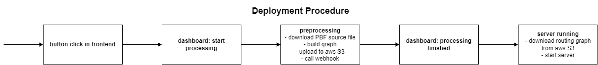

# Cloud Computing Project

This repository contains the project and its related files for the course ***Special Topics Cloud Computing Architectures, Processes and Operations*** (510.211) of the JKU Linz.

The original proposal for this project can be found in [PROPOSAL.md](PROPOSAL.md)

## Introduction

The goal of this project is to create a dashboard for deploying routing engines (e.g. [OSRM](http://project-osrm.org/)) and visualising their covered area.

Based on the dashboard, users are able to view which routing engines currently running, visualise which area they cover and deploy new routing engines based on selecting from a set of possible areas where data is existing.

All deployed routing engines are shown on a map, such that a user can easily see which areas are already covered and running. Setting up a new routing engine generally involves two steps: preprocessing (done via a kubernetes Job) and running the routing engine (done in a kubernetes Service).

The pre-processed street network data is stored on AWS S3 and Kubernetes (via Amazon EKS) is used to deploy the routing engines.

### Description

In the dashboard, the user can see all currently active routing-areas, their mode and the areas they cover. Via _Add New Region_, the user is prompted to sub-page where a new area and the specific mode can be selected for deployment. Furthermore, we've added the possibility of deleting a specific routing-area by pressing _Delete Selected Region_ after selecting an area.

_We want to futher clarify how the exact steps that happen after a user chooses to deploy a new "area" for routing_

When a user chooses to deploy a new routing-area, the following "deployment pipeline" is triggered:

- the dashboard-backend receives the requested area and a transport mode (either car, bike or foot) from the UI and starts a `routing-preprocess` (Kubernetes) job via the REST API.
- the `routing-preprocess` job...
  - downloads data about the street network in the selected area
  - pre-processes the street network data for the selected transport mode
  - uploads the pre-processed result to an S3 bucket
- the dashboard-backend is notified when the pre-processed results were uploaded and creates a kubernetes `routing-app` service
- the `routing-app` downloads the pre-processed routing data and starts serving the routing API

The "deployment" of each server is done along the following pipeline:




### Deployment Architecture


### Responsibilities

#### Sebastian Tanzer

- UI for dashboard application
- Part of backend for dashboard application

#### Christopher Stelzmüller

- Docker Container for routing engine ([tuesd4y/osrm-backend-eks](https://github.com/tuesd4y/osrm-backend-eks)) - including options for running and preprocessing
- Kubernetes Service for running routing engines
- Kubernets Job for preprocessing routing engines
- Dashboard Backend for interfacing with kubernetes API

## Research

### Horizontal Pod Autoscaling

https://docs.aws.amazon.com/eks/latest/userguide/metrics-server.html

A [HorizontalPodAutoscaler](https://kubernetes.io/docs/tasks/run-application/horizontal-pod-autoscale/) allows scaling up (or down) the number of running instances of a service based on its load. In order to create a horizontalAutoscaler, we generally have to specify which metrics should be observed (e.g. CPU utilisation), under what constraints Deployments can be scaled (e.g. 1-4 running instances) and what Deployment should be the target of scaling. 

In our project, one AutoscalerInstance is created for each deployment of a routing service. We're scaling our services, such that an average CPU utilisation of 30% is reached. While this is (for production use) a rather low value, it helps illustrate the Autoscalers capabilities during our live demo.

In our project, the read autoscalers to deploye are created in a Kotlin Code and deployed using the Kubernetes Java client API, but an exemplary definition of an autoscaler can also be found in [autoscaler.yaml](routing-service/autoscaler.yaml).

In order for the Autoscaler to work correctly based on metrics, we need to deploy a Kubernetes metrics server, that is later used for measuring the utilisation of our Deployments. As outlined in the [AWS EKS docs](https://docs.aws.amazon.com/eks/latest/userguide/metrics-server.html), a metrics-server can be easily deployed by running the following command.

```bash 
kubectl apply -f https://github.com/kubernetes-sigs/metrics-server/releases/latest/download/components.yaml
```

### Logging into the Kubernetes API using AWS EKS

Logging into our kubernetes cluster with AWS API credentials proved more complicated than expected. Whereas the AWS root account can directly login to the AWS CLI using `aws configure` , create a kubeconfig file with  `aws eks update-kubeconfig --name routing-cluster` and subsequently use the `kubectl` to interact with the cluster, this is not the case for other accounts.

In addition to giving the accounts permission to access the AWS EKS service, access to the kubernetes cluster itself has to be configured. The [AWS docs for allowing user access to clusters](https://docs.aws.amazon.com/eks/latest/userguide/add-user-role.html) outline that there is an `aws-auth` ConfigMap that outlines which users can access a cluster. We can add additional users by running  `kubectl edit -n kube-system configmap/aws-auth` from the root account and adding a `mapUsers` block at top level that looks similar to the following (Make sure to use the correct arn of the AWS user).

```yaml
mapUsers:
- userarn: arn:aws:iam::614832161943:user/uni-sebastian
  username: uni-sebastian
  groups:
    - system:masters
```


### Configuring the Kubernetes Java API

Since our dashboard application is using the gradle build system, we can simply install the [kubernetes Java Client](https://github.com/kubernetes-client/java) by adding `compile("io.kubernetes:client-java:14.0.0")` to our gradle dependencies block. In order to access the API. 

Before interacting with the kubernetes API, we first need to configure the API client. In our project, this is happening in the init block in  [KubernetesApiProvider.kt](routing-dashboard/src/main/kotlin/com/tuesd4y/routingdashboard/config/KubernetsApiProvider.kt). With the following code part, we instruct the Kubernetes API Client to use the default loading mechanism for getting credentials.

```kotlin
val client = ClientBuilder.defaultClient()
setDefaultApiClient(client)
```

Afterwards, the kubernetes API can be accessed directly be the individual API Objects (e.g. by constructing a new `CoreV1Api()`). In order to be able to connect to and query the API, we also need to setup authentication and connection information to the kubernetes cluster - This is done using a kubeconfig file locally, or via a service account when the `routing-dashboard` is deployed.

#### Authentication via kubeconfig

If we're running the java `routing-dashboard` locally, and have a kubeconfig file in the default location (e.g. by creating it as outlined in the `Logging into the Kubernetes API using AWS EKS`-section), we need no further configuration

#### Authentication via Service accounts

In order to utilise the kubernetes API from within a cluster, we need to configure a ServiceAccount that has access to the API. Such a service account can also automatically be used by the kubernetes Java client in order to interact with the cluster. 

As outlined in the [kubernetes docs](https://kubernetes.io/docs/reference/access-authn-authz/rbac/#service-account-permissions), we can create a new service account for our `routing-dashboard` application by running the following code snippet:

```bash
kubectl create serviceaccount -n routing-service routing-dashboard-admin
kubectl create rolebinding admin-sa \
  --clusterrole=cluster-admin \
  --serviceaccount=routing-service:routing-dashboard-admin \
  --namespace=routing-service
```

Note, that here we create a `routing-dashboard-admin` serviceaccount and give it admin access to our cluster. We also need to configure the deployment of our routing-backed (which is handled in [routing-dashboard.yaml](routing-dashboard/routing-dashboard.yaml)) such that the deployment automatically gets assigned the service account. This is done by adding the service account into the deplyments template spec.

```yaml
...
  spec:
    serviceAccountName: routing-dashboard-admin
    containers:
    - name: routing-dashboard
    ...
```

### Kubernetes Jobs

We're using a [kubernetes job](https://kubernetes.io/docs/concepts/workloads/controllers/job/) in order to download, preprocess and upload the files needed for our routing services. We've found, that our initial docker containers used for describing the processing inside a job did not complete with an exit code, but rather stayed running indefinitely. In order to solve this, we've reconfigured the [underlying docker container](https://github.com/tuesd4y/osrm-backend-eks) to include an `OSRM_EXIT_AFTER_UPLOAD` environment variable - if this set to a non-empty value, the container exits after processing is done and data have been uploaded to S3.

## Lessons Learned

- We've found out that using special or uppercase characters in kubernetes API `name` fields doesn't work.
- We've found out that configuring access to EKS clusters for user accounts is different or AWS root users and regular users. As outlined in the `Research`-section, this needs special handling.
- We've found out, that AWS has a very cool feature that automatically quarantines (i.e. disallow access to all operations) AWS accounts whose API keys are unintentionally uploaded to github or otherwise exposed to the internet.

## Usage Example

### Requirements

- namespace routing-service
- AWS credentials in routing-dashboard.yaml
- configure AWS S3 bucket url in Java code
- apply routing-dashboard.yaml
- Setup of infrastructure and user accounts

- [14:27, 19.1.2022] Sebastian Tanz: ## Usage Example

  ### Requirements

  - namespace routing-service
  - AWS credentials in routing-dashboard.yaml
  - configure AWS S3 bucket url in Java code
  - apply routing-dashboard.yaml
  - Setup of infrastructure and user accounts

  ## TODO Open questions and next steps

  #### Hiding AWS Credentials from Storage

  Currently, the AWS Credentials are added in the application code. In the future, we will be using a Kubernetes Secret to store them so that we do not need to include confidential data in your application code.

  #### Show Current Scaling & Configure Mem/CPU

  The parameters for scaling a deployment are set in AutoscalerTemplate, while the allocation of memory and CPU resources is handled in DeploymentTemplate. For now, those are all static values. However, depending on the size of an area, the needed resources can be quite different. Therefore, we will add the possibility of setting these parameters in the UI for each area specifically.

  ### DNS based on service names + security for outside access

  

  ##  Tutorial

  #### Setup & Prerequisites

  To set up the project you have to download the directory  _routing-dashboard_. To the further sucessfuly run the project AWS Credentials have to be added in ``kotlin/com/tuesd4y/routingdashboard/config/AwsCredentials.kt``

  ```kotlin
  @Component
  class AwsCredentials(val environment: Environment) {
      val awsAccessKeyId: String
          get() = environment.getProperty("AWS_ACCESS_KEY_ID", "")
      val awsSecretAccessKey: String
          get() = environment.getProperty("AWS_SECRET_ACCESS_KEY", "")
  ```

  When loading the gradle project correctly the Spring Boot Configuration should be set automatically. However, if you are running Java 13 it could be that you have to add 
  ``-Djdk.tls.client.protocols=TLSv1.2`` as additional VM Option.

  After following the listed steps, there server can be started.

  #### Deploying New Service Area

  After starting the server, the UI can be accessed directly through the server's address. 

  By clicking on Add New Region a sub-window is opened, which allows to select a specific area the required mode of transport and submit it via Load the REST-Call for pre-processing is sent to the server. 

  

  - watch HPA for service
  - using load-generator to demonstrate scaling

  #### Check Newly Added Area in UI

  Depending on the size of the area, pre-preprocessing it and starting the specific routing server can take up to 24 hours. As soon as the area is ready, it will be shown in the UI under the Active Region Table and on the map.

  
